```
   ____                     _____       ___   _____ ____     ___              
  / __ \_      _____  ____ |__  /      /   | / ___// __ \   /   |  ____  ____ 
 / / / / | /| / / _ \/ __ \ /_ <______/ /| | \__ \/ /_/ /  / /| | / __ \/ __ \
/ /_/ /| |/ |/ /  __/ / / /__/ /_____/ ___ |___/ / _, _/  / ___ |/ /_/ / /_/ /
\___\_\|__/|__/\___/_/ /_/____/     /_/  |_/____/_/ |_|  /_/  |_/ .___/ .___/ 
                                                               /_/   /_/      
```

基于阿里 Qwen3-ASR 系列大模型的离线语音处理工具，集**语音转文本、角色分离、精准时间轴对齐、热词注入**于一体。



## 硬件需求

- **NVIDIA 显卡**，建议显存 6GB+
- 0.6B 极速版：6GB 显存
- 1.7B 高精版：8GB+ 显存（推荐 16GB）

---

## 下载模型文件

> 以下大文件未包含在 Git 仓库中，请从网盘下载后解压到项目根目录的 `app/` 下：

| 目录 | 说明 | 大小 |
|------|------|------|
| `app/models/` | ASR 模型 + 说话人分离模型 | ~2GB |
| `app/runtime/bin/` | ffmpeg / ffprobe / ffplay（仅 Windows 需要） | ~630MB |
| `app/runtime/VC运行库/` | VC++ Redistributable（仅 Windows 需要） | ~25MB |
| `app/runtime/WPy64-312101/` | 便携版 Python 3.12 + 依赖（仅 Windows 需要） | ~3GB |

> 网盘链接：[待补充]

---

## Windows 部署

### 方式一：便携版 Python（推荐，无需手动配置环境）

1. 从网盘下载 `WPy64-312101/` 并解压到 `app/runtime/` 目录

2. 运行 `app/runtime/VC运行库/VC_redist.x64.exe` 安装 VC++ 运行库（如已安装可跳过）

3. 启动：

```powershell
scripts\start.bat
```

启动后选择 [1] Portable Python，浏览器访问 `http://127.0.0.1:8000`

### 方式二：Conda 环境（自行构建）

### 1. 安装 Conda

下载 [Miniconda](https://docs.conda.io/en/latest/miniconda.html) 或 [Anaconda](https://www.anaconda.com/download) 并安装。

### 2. 创建环境并安装依赖

```powershell
conda create -n qwen3-asr python=3.12 -y
conda activate qwen3-asr

# PyTorch (CUDA 12.1)
pip install torch==2.5.1 torchaudio==2.5.1 --index-url https://download.pytorch.org/whl/cu121

# 项目依赖
pip install qwen-asr pyannote.audio fastapi uvicorn python-multipart pyyaml

# 卸载不兼容的 torchcodec
# torchcodec 是 pyannote 的可选 GPU 音频解码器，安装 pyannote.audio 时自动拉入
# 它与 torch 2.5.1 不兼容会报错，卸载后 pyannote 自动回退到 torchaudio 内存模式
# 模型推理仍在 GPU 上执行，不影响性能
pip uninstall torchcodec -y
```

### 3. 启动

```powershell
scripts\start.bat
```

启动后选择 [2] Conda，输入 python.exe 路径，浏览器访问 `http://127.0.0.1:8000`

---

## Ubuntu 部署

### 1. 安装系统依赖

```bash
sudo apt update
sudo apt install ffmpeg nvidia-driver-535 nvidia-cuda-toolkit -y
```

### 2. 安装 Conda

```bash
wget https://repo.anaconda.com/miniconda/Miniconda3-latest-Linux-x86_64.sh
bash Miniconda3-latest-Linux-x86_64.sh
# 重启终端后继续
```

### 3. 创建环境并安装依赖

```bash
git clone git@github.com:kafsaki/qwen3-asr-app.git
cd qwen3-asr-app

conda create -n qwen3-asr python=3.12 -y
conda activate qwen3-asr

# PyTorch (CUDA 12.1)
pip install torch==2.5.1 torchaudio==2.5.1 --index-url https://download.pytorch.org/whl/cu121

# 项目依赖
pip install qwen-asr pyannote.audio fastapi uvicorn python-multipart pyyaml

# 卸载不兼容的 torchcodec
# torchcodec 是 pyannote 的可选 GPU 音频解码器，安装 pyannote.audio 时自动拉入
# 它与 torch 2.5.1 不兼容会报错，卸载后 pyannote 自动回退到 torchaudio 内存模式
# 模型推理仍在 GPU 上执行，不影响性能
pip uninstall torchcodec -y
```

### 4. 启动

```bash
conda activate qwen3-asr
export HF_HUB_OFFLINE=1
export ASR_CHECKPOINT="$PWD/app/models/Qwen/Qwen3-ASR-0.6B"
export ALIGNER_CHECKPOINT="$PWD/app/models/Qwen/Qwen3-ForcedAligner-0.6B"
cd app
python main.py --ip 127.0.0.1 --port 8000
```

浏览器访问 `http://127.0.0.1:8000`

---

## 目录结构

```
├── app/                     # 应用主目录
│   ├── main.py              # 统一入口 (API + 静态文件服务)
│   ├── engine.py            # 转写引擎 (GPU 推理线程池隔离)
│   ├── hub.py               # 模型加载
│   ├── audio.py             # 音频处理 (ffmpeg)
│   ├── export.py            # SRT 字幕导出
│   ├── static/              # 前端静态资源 (HTML/CSS/JS)
│   ├── models/              # 模型文件 (需从网盘下载)
│   │   ├── Qwen/            # Qwen3-ASR 模型
│   │   └── speaker-diarization-community-1/  # 说话人分离模型
│   ├── runtime/             # Windows 运行环境 (需从网盘下载)
│   │   ├── bin/             # ffmpeg 二进制
│   │   ├── VC运行库/        # VC++ 运行库
│   │   └── WPy64-312101/    # 便携版 Python 3.12 + 依赖
│   ├── outputs/             # 转写结果输出
│   └── uploads/             # 临时上传文件
├── scripts/                 # 启动脚本
│   └── start.bat            # 一键启动脚本
└── README.md
```

## API 接口

| 方法 | 路径 | 功能 |
|------|------|------|
| GET | `/api/status` | 健康检查 |
| POST | `/api/transcribe` | 单音频转写 |
| POST | `/api/transcribe/batch` | 批量转写 |
| POST | `/api/align` | 文稿对齐 |
| GET | `/api/download/{folder}` | 下载结果 |

## 原作者

本项目基于 [生活作弊码](https://www.bilibili.com/video/BV11Sge6AETP/) 的 Qwen3-ASR Pro 懒人包重构，感谢原作者的卓越贡献。

## 致敬开源

- [Alibaba Qwen Team](https://github.com/QwenLM/Qwen3-ASR) - Qwen3-ASR 基础模型
- [Pyannote.audio](https://github.com/pyannote/pyannote-audio) - 说话人分离
- [FunASR](https://github.com/modelscope/FunASR) - 语音识别框架
- [FFmpeg](https://ffmpeg.org/) - 音视频处理

## License

本项目仅供学习交流使用。